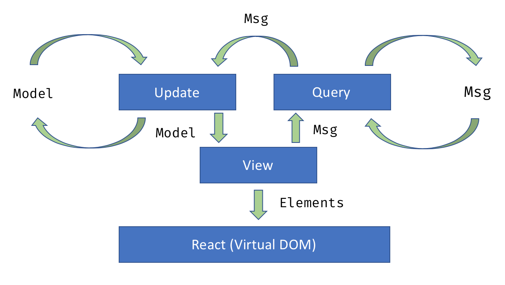

# Fable Reaction

Fable Reaction is a lightweight Async Reactive ([Rx](http://reactivex.io/)) [Elmish](https://elmish.github.io/)-ish library for F# targeting [Fable](http://fable.io/) and [React](https://reactjs.org/).

Fable Reaction is built on top of [Reaction](https://github.com/dbrattli/Reaction), and is currently a playground project ([WIP](https://en.wikipedia.org/wiki/Work_in_process)) for experimenting with MVU-based web applications using async reactive functional programming (Async Observables) in F#. The project is heavily inspired by [Elm](http://elm-lang.org/) and [Elmish](https://elmish.github.io/) but currently lives as a separate project.

The difference from Elmish and Elm is that Fable.Reaction does not need any commands (`Cmd`) or subscriptions. Instead we use a [ReactiveX](http://reactivex.io/) (Rx) style query that transforms the stream of messages (`Msg`).

## Reactive MVU Architecture

Fable Reaction is very similar to [Elm](http://elm-lang.org/) and [Elmish](https://elmish.github.io/) in regards to the [MVU architecture](https://guide.elm-lang.org/architecture/).



* **Model**, application state as immutable data
* **View**, a pure function that takes the model to produce the output view (HTML elements)
* **Message**, a data event that represents a change. Messages are generated by the view, or they may be generated out of "thin air" by the reaction query, e.g. timer or initial message events.
* **Update**, a pure function that produces a new model based on a received message and the previous model

In addition, Fable Reaction may also have a reaction, a query that transforms the "stream" of messages.

* **Reaction**, a query function that takes the message stream and produces a new (transformed) message stream. Note that this also replaces Elm(ish) commands (Cmd) since the reaction is free to produce initial messages out of thin air, transform, filter, time-shift messages and combine side-effects such as web requests (fetch) etc.

## Composition

Fable Reaction follows the Elm and Elmish style of functional composition. TBD.

## Examples

Examples of how to use Fable Reaction can be found in the examples folder. Current list of examples includes:

* [Counter](https://github.com/dbrattli/Fable.Reaction/blob/master/examples/Counter/src/Client/Client.fs), from the [SAFE](https://safe-stack.github.io/) stack template.
* [Timeflies](https://github.com/dbrattli/Fable.Reaction/blob/master/examples/Timeflies/src/Client/Client.fs). See description below.

The Timeflies example ([source code](https://github.com/dbrattli/Re-action/tree/master/examples/Timeflies)) implements the classic [Time Flies](https://blogs.msdn.microsoft.com/jeffva/2010/03/17/reactive-extensions-for-javascript-the-time-flies-like-an-arrow-sample/) example from [RxJS](https://rxjs-dev.firebaseapp.com/). This code is very simplar to Elmish but the difference is that we can compose powerful reactive
queries to transform, filter, aggregate and time-shift our stream of messages.

```f#
// The model holds data that you want to keep track of while the
// application is running
type Model = {
    Letters: Map<int, string * int * int>
}

// The Msg type defines what events/actions can occur while the
// application is running. The state of the application changes *only*
// in reaction to these events
type Msg =
    | Letter of int * string * int * int

// The update function computes the next state of the application based
// on the current state and the incoming messages
let update (currentModel : Model) (msg : Msg) : Model =
    match currentModel.Letters, msg with
    | _, Letter (i, c, x, y) ->
        { currentModel with Letters = currentModel.Letters.Add (i, (c, x, y)) }

let view (model : Model) (dispatch : Dispatch<Msg>) =
    let letters = model.Letters
    let offsetX x i = x + i * 10 + 15

    div [ Style [ FontFamily "Consolas, monospace"]] [
        for KeyValue(i, (c, x, y)) in letters do
            yield span [ Style [Top y; Left (offsetX x i); Position "absolute"] ] [
                str c
            ]
    ]

let init () : Model = { Letters = Map.empty }

// Message stream transformation.
let query (msgs : AsyncObservable<Msg>) : AsyncObservable<Msg>) =
    rx {
        let! i, c = Seq.toList "TIME FLIES LIKE AN ARROW"
                    |> Seq.mapi (fun i c -> i, c)
                    |> ofSeq

        let ms = fromMouseMoves () |> delay (100 * i)
        for m in ms do
            yield Letter (i, string c, int m.clientX, int m.clientY)
    }

Program.mkProgram init update view
|> Program.withReaction query
|> Program.withReact "elmish-app"
|> Program.run
```
